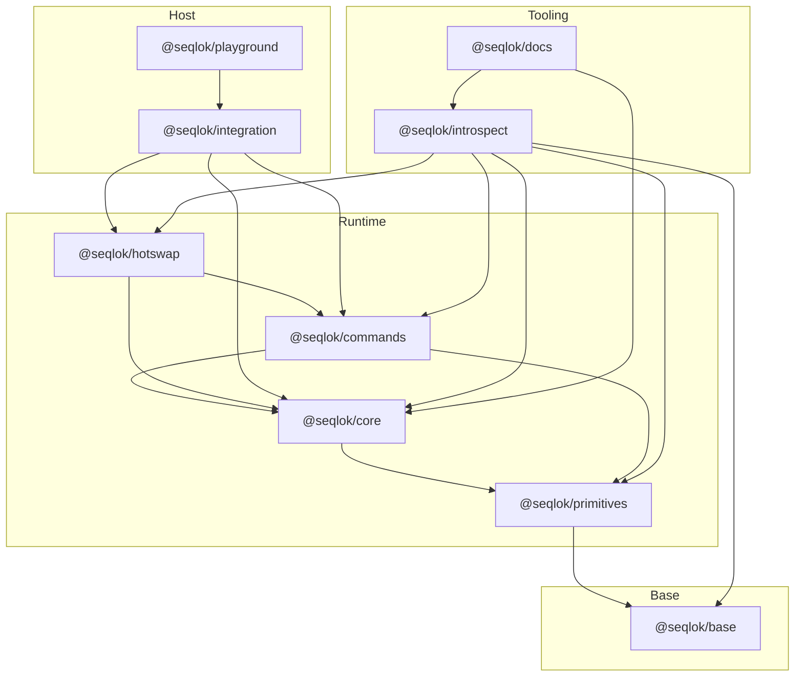

# Seqlok Package Architecture and Diagnostics Sidecar

This document defines the Seqlok package layout, the allowed dependency graph, and the role of the introspect package as a diagnostics sidecar.
It is the source of truth for how packages are allowed to depend on each other and how cross language error contracts
are shared.

If you change this, you are changing architecture, not just folder names.

## 1. Dependency graph and arrow meaning

We model package dependencies as a directed acyclic graph. The rule is:

> If there is an arrow `A --> B` then `A` is allowed to import `B`
> The reverse import `B` importing from `A` is forbidden

The canonical Seqlok package graph is:

Key properties:

* `@seqlok/base` has no outgoing edges. Nothing inside base imports any other Seqlok package
* All runtime packages import only from layers below them
* No runtime package imports `@seqlok/introspect`
* `@seqlok/introspect` is allowed to import from base and all runtime packages
* `@seqlok/docs` (planned docs tooling package) can import from both runtime and introspect
* `@seqlok/integration` and `@seqlok/playground` live above runtime and do not participate in core scheduling or seqlock
  logic

Any new package must be added to this graph and obey the arrow rule.

## 2. Package roles

### 2.1 `@seqlok/base`

Bottom layer. Defines cross language contracts and invariants that all other packages share.

Responsibilities:

* `JsonValue` model for JSON safe payloads

* Error severity and health enums used by error metadata

* The canonical wire error shape used across process and language boundaries

  * `SeqlokWireError`
  * `SeqlokWireResult<T>`

* Minimal assertion helpers if needed by all packages

Things that must not live in base:

* Seqlock implementations
* Parameter or meter logic
* Hotswap orchestration
* Any TypeScript only convenience helpers like typed `objectEntries`. Those either live in the package that uses them or
  in a separate language helper package if that ever exists

Base is deliberately small. It exists so that TypeScript, Rust, C and C plus plus can all agree on a minimal shared
contract for errors and JSON values.

### 2.2 `@seqlok/primitives`

Low level concurrency and memory utilities.

Responsibilities:

* Seqlock primitive and related wait free structures
* SharedArrayBuffer and TypedArray helpers with strict layout
* Critical low level operations that must stay allocation free and predictable

Primitives imports only from base. It must not depend on core, commands, hotswap, integration, introspect, or docs.

### 2.3 `@seqlok/core`

Shared state engine that builds on primitives.

Responsibilities:

* Spec definition: param and meter descriptions
* Layout planning for shared backing storage
* Backing allocation and view construction
* Controller and processor bindings on top of seqlock primitives
* Error domains for `env.*`, `backing.*`, `binding.*`, `spec.*`, `plan.*`, `handoff.*`, expressed in terms of the base error contracts

Core imports from primitives and base. Core must not import introspect.

### 2.4 `@seqlok/commands`

Command transport layer that sits on top of core and primitives.

Responsibilities:

* Lock free single writer rings and related command buffers
* Command payload definitions that work across threads
* Command publishing and consumption APIs that operate on top of core bindings

Commands imports from primitives, core and base. Commands must not import introspect.

### 2.5 `@seqlok/hotswap`

Engine lifecycle manager on top of commands and core.

Responsibilities:

* Engine spawn, prime, pre warm, blend and retire orchestration
* Swap ticket and versioning state machine
* Integration with command rings for deterministic engine changes

Hotswap imports from commands, core and base. Hotswap must not import introspect.

### 2.6 Host packages: `@seqlok/integration` and `@seqlok/playground`

These are not core runtime. They are host logic around the engine.

* `@seqlok/integration` wires Seqlok into a specific host world

  * Host topologies
  * Environment detection
  * Adaptation to browser, worker and node environments

  Integration imports from runtime packages and base, but must not sit under them in the DAG.

* `@seqlok/playground` is a non production host used for demos and development

  * Example topologies
  * Debug UIs
  * Visual inspections

  Playground imports from integration and is allowed to use introspect for debug tools.

### 2.7 Tooling packages: `@seqlok/introspect` and `@seqlok/docs`

Tooling is never on the hot path. It sees everything but nothing performance critical depends on it.

* `@seqlok/introspect` is a sidecar

  * Aggregates error registries from runtime packages
  * Produces derived artifacts such as `errors.registry.json`, JSON schemas, generated documentation fragments and
    future native error code definitions
  * Defines observability payloads such as log events and metrics that wrap `SeqlokWireError`
  * Provides small utilities for docs and host code to query error metadata

  Introspect imports from base and all runtime packages. No runtime package imports introspect.

* `@seqlok/docs` is documentation build tooling

  * Uses core and introspect to generate or render architecture and API documentation
  * Can read from registries and introspect outputs

  Docs imports from core, introspect and base. No runtime package imports docs.

## 3. Diagnostics as a sidecar

Diagnostics is intentionally not part of the runtime stack. The pattern is:

* Runtime packages define errors and produce them
* Diagnostics observes, aggregates and reports on those errors
* No runtime code requires introspect to be present in order to function

Concretely:

* Error definitions live in each runtime package

  * `@seqlok/primitives` owns `primitives.*` error codes
  * `@seqlok/core` owns `env.*`, `backing.*`, `binding.*`, `spec.*`, `plan.*`, `handoff.*` error codes
  * `@seqlok/commands` owns `commands.*` error codes
  * `@seqlok/hotswap` owns `hotswap.*` error codes

* Diagnostics imports the registry slices from each runtime package and combines them into a global view

* Diagnostics may emit:

  * A combined JSON file of all error codes with severity, health, message templates and JSON schemas
  * Code generated artifacts for native languages
  * Tables and summaries consumed by docs or host observability

Diagnostics must never own the canonical definition of runtime errors. That ownership stays with the packages that can
actually produce those errors.

## 4. Error contracts and cross language boundary

The base error contracts are the only part of the error system that all languages must agree on. Everything else is an
implementation detail.

### 4.1 `SeqlokWireError` in `@seqlok/base`

`SeqlokWireError` is the small, stable envelope used when an error crosses any process or language boundary.

Its fields are:

* `code`

  * string such as `core.paramsOverflow`
  * globally unique across all packages

* `message`

  * human readable message in the current locale
  * already formatted with any parameters applied

* `details`

  * optional JSON safe payload with machine readable context
  * must be valid `JsonValue` defined in base

* `severity`

  * how serious this specific error instance is

* `health`

  * how this error affects component or system health

* `source`

  * optional identifier of the package that emitted the error

* `transient` flag

  * optional hint that this error may resolve without manual intervention

* `timestampMs`

  * optional timestamp in milliseconds when this error was observed

Runtime packages are free to implement richer error types internally, but anything that leaves the process or crosses a
worker boundary must be converted to `SeqlokWireError` first.

### 4.2 `SeqlokWireResult<T>`

`SeqlokWireResult<T>` is the standard shape for returning either a value or a wire error from a boundary call such as:

* worker messages
* host integration calls
* future native bindings

It is defined once in base and re used everywhere.

Runtime code is not required to use this shape internally. It is only required at boundaries.

### 4.3 Registries

Each runtime package owns an error registry slice that describes its error codes in terms of the base contracts. A
registry entry contains:

* `code`
* `package`
* `severity`
* `health`
* message template
* JSON schema for details

Diagnostics reads these slices and produces combined registry views. Host code and docs never guess error properties by
hand. They use metadata from the registry outputs.

## 5. Import rules checklists

To avoid accidental violations, this section spells out allowed imports per package.

### 5.1 `@seqlok/base`

May import:

* nothing inside the Seqlok monorepo

Any import from another Seqlok package is a layering violation.

### 5.2 `@seqlok/primitives`

May import:

* `@seqlok/base`

Must not import:

* `core`
* `commands`
* `hotswap`
* `integration`
* `introspect`
* `docs`

### 5.3 `@seqlok/core`

May import:

* `@seqlok/base`
* `@seqlok/primitives`

Must not import:

* `commands`
* `hotswap`
* `integration`
* `introspect`
* `docs`

### 5.4 `@seqlok/commands`

May import:

* `@seqlok/base`
* `@seqlok/primitives`
* `@seqlok/core`

Must not import:

* `hotswap`
* `integration`
* `introspect`
* `docs`

### 5.5 `@seqlok/hotswap`

May import:

* `@seqlok/base`
* `@seqlok/primitives`
* `@seqlok/core`
* `@seqlok/commands`

Must not import:

* `integration`
* `introspect`
* `docs`

### 5.6 `@seqlok/integration`

May import:

* `@seqlok/base`
* `@seqlok/primitives`
* `@seqlok/core`
* `@seqlok/commands`
* `@seqlok/hotswap`

May also import introspect for tooling or debug purposes, but any such usage must be clearly treated as non critical.

### 5.7 `@seqlok/playground`

May import:

* `@seqlok/integration`
* `@seqlok/introspect`
* Anything needed to support debug UI or examples

Playground is not part of the core runtime. It is allowed to pull in introspect since it is not a hot path.

### 5.8 `@seqlok/introspect`

May import:

* `@seqlok/base`
* `@seqlok/primitives`
* `@seqlok/core`
* `@seqlok/commands`
* `@seqlok/hotswap`

Must not be imported by any runtime package. Only host side and docs may import introspect.

### 5.9 `@seqlok/docs`

May import:

* `@seqlok/base`
* `@seqlok/core`
* `@seqlok/introspect`

Must not be imported by runtime packages.

## 6. Non negotiable invariants

To keep this architecture intact:

1. The mermaid graph above is the canonical dependency graph. Any change in allowed dependencies must be reflected in
   that graph in the same change set
2. `@seqlok/base` is the only package that defines cross language error and JSON contracts
3. Runtime packages define their own error codes but never aggregate codes from dependencies into new registries
4. `@seqlok/introspect` is a sidecar. Runtime packages do not import it
5. Any error crossing process, thread or language boundaries must be represented as `SeqlokWireError` from base
6. Registry outputs are derived from runtime registry slices through introspect. They are not hand written

If these rules are kept, Seqlok remains:

* easy to port to Rust, C and C plus plus
* easy to reason about for observers and hosts
* resistant to accidental layering violations in the hot path

