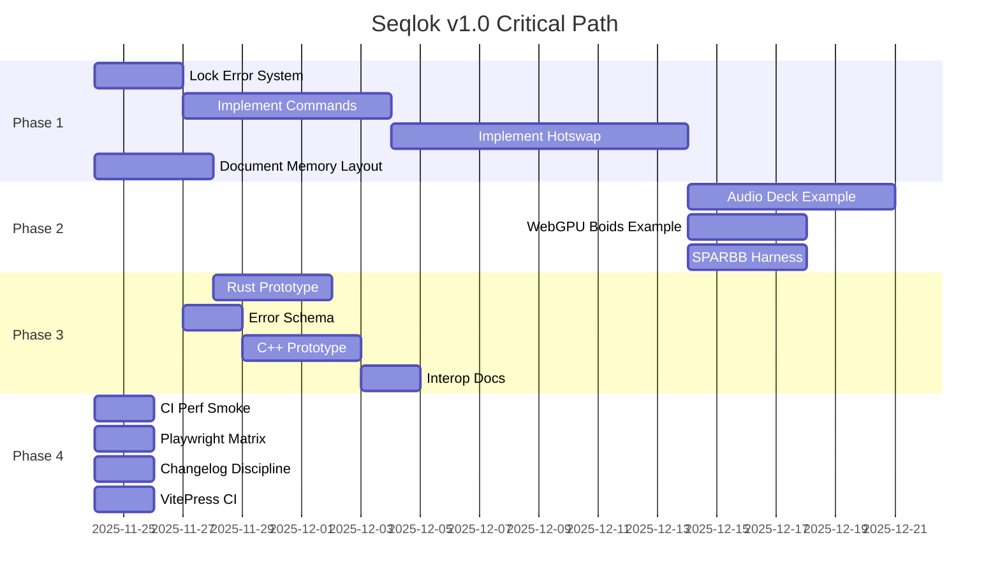

# Seqlok v1.0 – Critical Path

**Purpose**: The shortest sequence of work to reach production-ready v1.0.  
**Estimated Total**: 6-8 weeks (assuming focused, full-time effort)  
**Start Date**: 2025-11-24  
**Target Ship Date**: 2026-01-19 (8 weeks)

---

## Overview

This document breaks down the minimum viable work to ship Seqlok v1.0. Each phase has:
- Specific deliverables
- Time estimates
- Dependencies
- Acceptance criteria

**Phases**:
1. **Complete Core Contracts** (2-3 weeks)
2. **Prove the System** (2 weeks)
3. **Cross-Language Validation** (1-2 weeks)
4. **Production Hardening** (1 week)

---

## Phase 1: Complete Core Contracts (2-3 weeks)

**Goal**: Finish implementing the golden flow end-to-end, including commands and hotswap.

### Task 1.1: Lock Error System (0.5 weeks)
**Status**: 🟢 95% done  
**Remaining Work**:
- [ ] Generate JSON schema from error registry
- [ ] Add error codes for commands package
- [ ] Add error codes for hotswap package
- [ ] Validate schema against live registry in CI

**Acceptance**:
- JSON schema file exists at `packages/core/schemas/errors.schema.json`
- Schema includes all current error codes with metadata
- CI step validates registry matches schema
- Rust/C++ can consume schema to generate enums

**Files to Create/Modify**:
```
packages/core/scripts/generate-error-schema.ts
packages/core/schemas/errors.schema.json (generated)
.github/workflows/validate-error-schema.yml (or in existing CI)
```

**Time**: 2-3 days

---

### Task 1.2: Implement `@seqlok/commands` (1 week)
**Status**: 🔴 Not started  
**Dependencies**: None (foundation + primitives already exist)

**Deliverables**:
- [ ] Command ring (SWSR or MWSR based on DoD)
- [ ] Command submission API
- [ ] Command consumption API
- [ ] Scheduled command support (bar/beat/sample aligned)
- [ ] Command lifecycle: enqueue → pending → active → completed/failed
- [ ] Error codes for command domain

**API Surface** (draft):
```typescript
// Producer side
interface CommandProducer<TCmd> {
  enqueue(cmd: TCmd): Result<CommandTicket, SeqlokError>;
  tryEnqueue(cmd: TCmd): Result<CommandTicket, SeqlokError> | null;
  capacity(): number;
}

// Consumer side
interface CommandConsumer<TCmd> {
  poll(): TCmd | null;
  consume(cb: (cmd: TCmd) => void): void;
  available(): number;
}

// Creation
function createCommandRing<TCmd>(
  spec: CommandRingSpec,
  backing: SharedArrayBuffer
): { producer: CommandProducer<TCmd>; consumer: CommandConsumer<TCmd> };
```

**Testing**:
- [ ] Unit tests for enqueue/poll
- [ ] Cross-thread producer/consumer tests
- [ ] Stress test: bursty command load
- [ ] Property test: FIFO ordering guaranteed
- [ ] Property test: no command loss or duplication

**Documentation**:
- [ ] `docs/architecture/18-command-ring-*.md` (expand existing)
- [ ] API reference for command ring
- [ ] Example: scheduling commands from UI thread

**Files to Create**:
```
packages/commands/src/ring.ts
packages/commands/src/producer.ts
packages/commands/src/consumer.ts
packages/commands/src/types.ts
packages/commands/src/errors/codes/commands.ts
packages/commands/tests/ring.test.ts
packages/commands/tests/cross-thread.test.ts
packages/commands/tests/stress.test.ts
```

**Acceptance**:
- Command ring works in Node worker threads
- Command ring works in browser workers (Playwright test)
- All tests pass
- Benchmarks show <1µs enqueue/poll times
- Documentation is clear enough for new engineer to use

**Time**: 5-7 days

---

### Task 1.3: Implement `@seqlok/hotswap` (1-1.5 weeks)
**Status**: 🔴 Not started  
**Dependencies**: Task 1.2 (commands)

**Deliverables**:
- [ ] Engine lifecycle: idle → spawning → primed → preWarming → active → teardown
- [ ] Hotswap protocol: swap ticket, crossfade params, deterministic cutover
- [ ] Integration with command ring for swap scheduling
- [ ] Error codes for hotswap domain
- [ ] Formally verified invariants (at most one active engine per slot)

**API Surface** (draft):
```typescript
interface EngineSlot<TParams, TMeters> {
  currentEngine: EngineHandle | null;
  spawn(factory: EngineFactory): Result<SwapTicket, SeqlokError>;
  swap(ticket: SwapTicket, crossfadeDuration: number): Result<void, SeqlokError>;
  abort(ticket: SwapTicket): Result<void, SeqlokError>;
  teardown(): Result<void, SeqlokError>;
}

interface SwapTicket {
  id: string;
  state: 'spawning' | 'primed' | 'preWarming' | 'crossfading' | 'completed' | 'aborted' | 'failed';
}

function createEngineSlot<TParams, TMeters>(
  spec: EngineSlotSpec,
  commandRing: CommandConsumer<EngineCommand>
): EngineSlot<TParams, TMeters>;
```

**Testing**:
- [ ] Unit tests for lifecycle state machine
- [ ] Swap without overlap (old teardown → new activate)
- [ ] Swap with crossfade (old + new both active briefly)
- [ ] Abort mid-swap
- [ ] Multiple concurrent swap attempts (should reject)
- [ ] Property test: ticket lifecycle reaches terminal state
- [ ] Property test: at most one active engine per slot
- [ ] Stress test: rapid swap commands

**Documentation**:
- [ ] `docs/architecture/19-hotswap-protocol.md`
- [ ] Formal invariants and state machine diagram
- [ ] API reference
- [ ] Example: hot-swap time-stretch algorithm mid-track

**Files to Create**:
```
packages/hotswap/src/slot.ts
packages/hotswap/src/lifecycle.ts
packages/hotswap/src/ticket.ts
packages/hotswap/src/protocol.ts
packages/hotswap/src/types.ts
packages/hotswap/src/errors/codes/hotswap.ts
packages/hotswap/tests/lifecycle.test.ts
packages/hotswap/tests/swap.test.ts
packages/hotswap/tests/abort.test.ts
packages/hotswap/tests/invariants.prop.test.ts
```

**Acceptance**:
- Hotswap works in Node + browser
- State machine respects all documented invariants
- Property tests pass for ticket lifecycle and engine uniqueness
- Crossfade timing is deterministic and accurate
- Documentation explains protocol clearly

**Time**: 7-10 days

---

### Task 1.4: Document Memory Layout Spec (0.5 weeks)
**Status**: 🟡 Partial  
**Dependencies**: None (can do in parallel)

**Deliverables**:
- [ ] Formal memory layout specification document
- [ ] Binary format for param planes
- [ ] Binary format for meter planes
- [ ] Binary format for command rings
- [ ] Alignment requirements
- [ ] Endianness handling
- [ ] Version field for future compatibility

**Document Structure**:
```markdown
# Seqlok Memory Layout Specification v1.0

## Overview
- Purpose: enable Rust/C++/other hosts to interoperate with TS/WASM
- Versioning: layout version field at offset 0
- Endianness: little-endian (WebAssembly default)

## Global Header (64 bytes)
- Offset 0-3: Magic number (0x53 0x45 0x51 0x4C) "SEQL"
- Offset 4-5: Version (uint16)
- Offset 6-7: Reserved
- ...

## Param Plane Layout
- Seqlock counter (int32 at offset 0)
- Scalar params (offset 8+, packed by type)
- Array params (offset after scalars, length-prefixed)
- ...

## Meter Plane Layout
- ...

## Command Ring Layout
- ...

## Type Encodings
- u8, u16, u32, i8, i16, i32, f32, f64
- Alignment rules
- ...

## Examples
- C struct definitions
- Rust struct definitions
```

**Files to Create**:
```
docs/interop/memory-layout-spec-v1.md
docs/interop/c-bindings-example.h
docs/interop/rust-bindings-example.rs
```

**Acceptance**:
- Spec is detailed enough for C/Rust dev to implement without reading TS source
- Examples compile and demonstrate correct memory access
- Spec includes version field for future evolution

**Time**: 3-4 days

---

## Phase 2: Prove the System (2 weeks)

**Goal**: Build two reference integrations and comprehensive stress tests to prove Seqlok works end-to-end.

### Task 2.1: Reference Integration #1 – Audio Deck (1 week)
**Status**: 🔴 Not started  
**Dependencies**: Phase 1 complete

**Deliverables**:
- [ ] Minimal DJ deck engine (≤200 lines)
- [ ] Controller thread (UI controls)
- [ ] Processor thread (audio processing)
- [ ] Observer thread (waveform rendering)
- [ ] Uses params: `playbackRate`, `volume`, `filterFreq`
- [ ] Uses meters: `position`, `level`, `bpm`
- [ ] Demonstrates hotswap: switch from simple pitch to timestretch algo
- [ ] Zero dropouts under normal load

**Structure**:
```
examples/audio-deck/
  ├── src/
  │   ├── controller.ts    # UI thread
  │   ├── processor.ts     # Audio worklet
  │   ├── observer.ts      # Waveform worker
  │   ├── engines/
  │   │   ├── simple-pitch.ts
  │   │   └── timestretch.ts
  │   └── index.html
  ├── README.md
  └── package.json
```

**Testing**:
- [ ] Manual test: play a track, adjust controls, see waveform update
- [ ] Automated test: measure dropout rate (should be 0%)
- [ ] Hotswap test: switch engine mid-track, verify no glitch

**Acceptance**:
- Example runs in Chrome/Firefox/Safari
- Controls are responsive (<100ms UI feedback)
- Audio never drops out
- Hotswap is seamless (no click/pop)
- Code is readable by new engineer

**Time**: 5-7 days

---

### Task 2.2: Reference Integration #2 – WebGPU Boids (0.5 weeks)
**Status**: 🔴 Not started  
**Dependencies**: Phase 1 complete

**Deliverables**:
- [ ] WebGPU boid simulation with params/meters
- [ ] Controller thread (UI sliders)
- [ ] Processor thread (simulation worker)
- [ ] Observer thread (render to canvas)
- [ ] Uses params: `gravity`, `cohesion`, `separation`, `alignment`
- [ ] Uses meters: `avgSpeed`, `clusterCount`, `fps`
- [ ] Demonstrates hotswap: switch between CPU and GPU kernels
- [ ] Maintains 60fps with 1000+ boids

**Structure**:
```
examples/webgpu-boids/
  ├── src/
  │   ├── controller.ts
  │   ├── sim-worker.ts
  │   ├── render.ts
  │   ├── kernels/
  │   │   ├── cpu-kernel.ts
  │   │   └── gpu-kernel.ts
  │   └── index.html
  ├── README.md
  └── package.json
```

**Acceptance**:
- Example runs in Chrome/Edge (WebGPU support)
- Maintains 60fps with 1000 boids
- Hotswap between CPU/GPU kernels is seamless
- Demonstrates non-audio use case clearly

**Time**: 3-4 days

---

### Task 2.3: SPARBB-Style Stress Harness (0.5 weeks)
**Status**: 🔴 Not started  
**Dependencies**: Phase 1 complete

**Deliverables**:
- [ ] Randomized state machine tester
- [ ] Operations: start, stop, swap, abort, param update, meter read
- [ ] Invariant checks after each operation
- [ ] Runs for N iterations or until failure
- [ ] Clear failure reports with state dump

**Structure**:
```typescript
interface HarnessConfig {
  iterations: number;
  operations: OperationType[];
  invariants: InvariantCheck[];
  seed?: number;
}

type OperationType = 
  | 'start' | 'stop' | 'swap' | 'abort' 
  | 'updateParam' | 'readMeter' | 'sendCommand';

type InvariantCheck = (state: SystemState) => Result<void, string>;

function runStressHarness(config: HarnessConfig): Result<void, FailureReport>;
```

**Testing**:
- [ ] Harness runs in CI (shorter config)
- [ ] Harness runs locally with long config (10k+ iterations)
- [ ] Known failure cases are detected correctly
- [ ] No false positives

**Files to Create**:
```
packages/hotswap/tests/stress-harness.ts
packages/hotswap/tests/sparbb.test.ts
```

**Acceptance**:
- Harness can run unattended for hours
- Failures are reproducible (seeded RNG)
- Invariants catch known bugs
- CI runs harness on every commit (shorter version)

**Time**: 3-4 days

---

## Phase 3: Cross-Language Validation (1-2 weeks)

**Goal**: Prove Seqlok's semantics work across languages by building minimal Rust and C++ prototypes.

### Task 3.1: Rust Prototype – Params/Meters via SAB (0.5 weeks)
**Status**: 🔴 Not started  
**Dependencies**: Task 1.4 (memory layout spec)

**Deliverables**:
- [ ] Rust crate that reads params from SAB
- [ ] Rust crate that writes meters to SAB
- [ ] Uses memory layout spec to parse binary format
- [ ] Demonstrates coherent reads/writes
- [ ] Interoperates with TS host

**Structure**:
```rust
// seqlok-rs/src/lib.rs
pub struct ParamReader {
    buffer: Arc<[AtomicU8]>,
    layout: Layout,
}

impl ParamReader {
    pub fn read_scalar<T>(&self, key: &str) -> Result<T, Error>;
    pub fn read_array<T>(&self, key: &str) -> Result<Vec<T>, Error>;
    pub fn snapshot(&self) -> Snapshot;
}

pub struct MeterWriter {
    buffer: Arc<[AtomicU8]>,
    layout: Layout,
}

impl MeterWriter {
    pub fn write_scalar<T>(&mut self, key: &str, value: T) -> Result<(), Error>;
    pub fn write_array<T>(&mut self, key: &str, values: &[T]) -> Result<(), Error>;
    pub fn publish(&mut self) -> Result<(), Error>;
}
```

**Testing**:
- [ ] Rust reads params written by TS
- [ ] TS reads meters written by Rust
- [ ] No data corruption under concurrent access
- [ ] Benchmark: read/write times comparable to TS

**Acceptance**:
- Rust code compiles and runs
- Interoperates with TS host without errors
- Memory layout spec is proven correct

**Time**: 3-4 days

---

### Task 3.2: Generate Error Schema (0.25 weeks)
**Status**: 🔴 Not started (part of Task 1.1 but grouped here)  
**Dependencies**: Task 1.1

**Deliverables**:
- [ ] JSON schema file with all error codes
- [ ] Schema includes: code, domain, severity, payload type
- [ ] Script to generate schema from TS error registry
- [ ] CI validates schema matches registry

**Schema Structure**:
```json
{
  "$schema": "http://json-schema.org/draft-07/schema#",
  "title": "Seqlok Error Registry v1.0",
  "errors": {
    "internal.invariantViolation": {
      "domain": "internal",
      "severity": "error",
      "message": "Internal invariant violated: {details}",
      "payload": {
        "type": "object",
        "properties": {
          "details": { "type": "string" }
        }
      }
    },
    // ... all other codes
  }
}
```

**Files to Create**:
```
packages/core/scripts/generate-error-schema.ts
packages/core/schemas/errors.schema.json (generated)
```

**Acceptance**:
- Schema includes all current error codes
- Schema is valid JSON Schema Draft 7
- CI validates schema on every commit

**Time**: 1-2 days

---

### Task 3.3: C++ Prototype – Error Schema + Backing (0.5 weeks)
**Status**: 🔴 Not started  
**Dependencies**: Task 3.2

**Deliverables**:
- [ ] C++ header that consumes error schema
- [ ] C++ enums for all error codes
- [ ] C++ backing allocation (allocate SAB-like memory)
- [ ] Demonstrates error handling matches TS semantics

**Structure**:
```cpp
// seqlok-cpp/include/seqlok/errors.hpp
namespace seqlok {

enum class ErrorCode {
    InternalInvariantViolation,
    PrimitivesSeqlockWrapAround,
    // ... generated from schema
};

struct Error {
    ErrorCode code;
    std::string message;
    std::optional<json> payload;
};

} // namespace seqlok

// seqlok-cpp/include/seqlok/backing.hpp
namespace seqlok {

struct Layout {
    size_t param_plane_size;
    size_t meter_plane_size;
    // ... from layout spec
};

class Backing {
public:
    static Result<Backing, Error> allocate(const Layout& layout);
    uint8_t* param_plane();
    uint8_t* meter_plane();
};

} // namespace seqlok
```

**Testing**:
- [ ] C++ code compiles with g++/clang
- [ ] Error codes match TS registry
- [ ] Backing allocation works

**Acceptance**:
- C++ code compiles cleanly
- Error handling is idiomatic C++
- Backing implementation matches layout spec

**Time**: 3-4 days

---

### Task 3.4: Document Interop Patterns (0.25 weeks)
**Status**: 🔴 Not started  
**Dependencies**: Tasks 3.1, 3.3

**Deliverables**:
- [ ] Guide: "Porting Seqlok to Rust/C++"
- [ ] Memory layout spec (already in Task 1.4)
- [ ] Error schema spec (already in Task 3.2)
- [ ] Example: JS host + Rust processor

**Files to Create**:
```
docs/interop/porting-guide.md
docs/interop/js-rust-example.md
```

**Acceptance**:
- Guide is clear enough for experienced Rust/C++ dev
- Examples demonstrate full interop story

**Time**: 1-2 days

---

## Phase 4: Production Hardening (1 week)

**Goal**: Lock in quality gates and make Seqlok shippable.

### Task 4.1: CI Performance Smoke Test (0.25 weeks)
**Status**: 🔴 Not started  
**Dependencies**: None (can do anytime)

**Deliverables**:
- [ ] CI step that runs benchmarks
- [ ] Fails if hot-path timings exceed 3x budget
- [ ] Machine-readable output for tracking

**CI Config**:
```yaml
# .github/workflows/perf.yml
name: Performance Smoke Test

on: [push, pull_request]

jobs:
  perf:
    runs-on: ubuntu-latest
    steps:
      - uses: actions/checkout@v3
      - uses: actions/setup-node@v3
      - run: pnpm install
      - run: pnpm bench
      - run: pnpm bench:validate # fails if >3x budget
```

**Script**:
```typescript
// scripts/bench-validate.ts
import { benchResults } from './bench-results.json';

const BUDGETS = {
  'seqlock.publish': 300, // 3x of 100ns
  'params.stage': 600,     // 3x of 200ns
  'meters.snapshot': 3000, // 3x of 1000ns
};

for (const [name, budget] of Object.entries(BUDGETS)) {
  const actual = benchResults[name];
  if (actual > budget) {
    throw new Error(`Perf regression: ${name} = ${actual}ns (budget: ${budget}ns)`);
  }
}
```

**Acceptance**:
- CI fails on perf regression
- Developers are notified immediately

**Time**: 1-2 days

---

### Task 4.2: Playwright Cross-Env Matrix (0.25 weeks)
**Status**: 🔴 Not started  
**Dependencies**: None

**Deliverables**:
- [ ] Playwright tests for browser environments
- [ ] Test matrix: [Chrome, Firefox, Safari] × [SAB, No-SAB] × [Atomics, No-Atomics]
- [ ] Graceful degradation when features missing

**Test Matrix**:
```typescript
// tests/cross-env.playwright.test.ts
const BROWSERS = ['chromium', 'firefox', 'webkit'];
const FEATURES = [
  { sab: true, atomics: true, wasm: true },
  { sab: false, atomics: false, wasm: true },
  { sab: true, atomics: true, wasm: false },
  // ...
];

for (const browser of BROWSERS) {
  for (const features of FEATURES) {
    test(`${browser} with ${JSON.stringify(features)}`, async ({ page }) => {
      // Inject feature detection overrides
      // Run core Seqlok operations
      // Verify expected behavior or error
    });
  }
}
```

**Acceptance**:
- Tests run in CI on all major browsers
- Seqlok handles missing features gracefully
- Error messages guide users to enable features

**Time**: 1-2 days

---

### Task 4.3: Enforce Changelog Discipline (0.25 weeks)
**Status**: 🔴 Not started  
**Dependencies**: None

**Deliverables**:
- [ ] CHANGELOG.md template for each package
- [ ] commitlint rules enforce changelog updates
- [ ] CI fails on missing changelog entry (for non-chore commits)

**Commit Hook**:
```javascript
// commitlint.config.ts
export default {
  extends: ['@commitlint/config-conventional'],
  rules: {
    'require-changelog': [2, 'always'],
  },
  plugins: [
    {
      rules: {
        'require-changelog': (parsed) => {
          const { type, scope } = parsed;
          if (type === 'chore') return [true];
          
          // Check if CHANGELOG.md was modified in this commit
          const changedFiles = execSync('git diff --name-only HEAD^').toString();
          if (!changedFiles.includes('CHANGELOG.md')) {
            return [false, 'Non-chore commits must update CHANGELOG.md'];
          }
          return [true];
        },
      },
    },
  ],
};
```

**Acceptance**:
- Commits without changelog updates are rejected (except chores)
- Each package has a CHANGELOG.md
- CI validates changelog format

**Time**: 1-2 days

---

### Task 4.4: VitePress Build in CI (0.25 weeks)
**Status**: 🔴 Not started  
**Dependencies**: None

**Deliverables**:
- [ ] VitePress config points to docs/
- [ ] CI step builds docs site
- [ ] Fails on broken links or invalid markdown

**CI Config**:
```yaml
# .github/workflows/docs.yml
name: Documentation

on: [push, pull_request]

jobs:
  docs:
    runs-on: ubuntu-latest
    steps:
      - uses: actions/checkout@v3
      - uses: actions/setup-node@v3
      - run: pnpm install
      - run: pnpm docs:build
      - run: pnpm docs:validate # checks for broken links
```

**Acceptance**:
- Docs build without errors
- Broken internal links are caught
- CI fails on doc build failure

**Time**: 1-2 days

---

## Timeline & Dependencies



**Critical Path Bottlenecks**:
1. Commands → Hotswap (sequential dependency)
2. Hotswap → Examples (can't prove system without hotswap)
3. Memory Layout Spec → Rust/C++ (spec must be correct first)

**Parallelizable Work**:
- Memory layout spec (Phase 1) can start immediately
- Phase 4 tasks can all run in parallel with other phases
- Error schema generation can happen as soon as error system is locked

---

## Risk Mitigation

### Risk: Hotswap Protocol Complexity
**Probability**: High  
**Impact**: Could delay Phase 1 by 1-2 weeks  
**Mitigation**:
- Start with simplest swap protocol (no crossfade)
- Add crossfade in v1.1 if too complex
- Formalize invariants early (TLA+ or similar)

### Risk: Cross-Language Interop Harder Than Expected
**Probability**: Medium  
**Impact**: Could delay Phase 3 by 1 week  
**Mitigation**:
- Start with Rust only (skip C++ if tight on time)
- Focus on read/write, not full host implementation
- Accept "proof of concept" quality for v1.0

### Risk: Performance Regressions in CI
**Probability**: Low  
**Impact**: Minimal (just fix immediately)  
**Mitigation**:
- Set loose budgets (3x) to avoid false positives
- Run perf tests on dedicated CI runner (consistent environment)

### Risk: Scope Creep from "Nice to Have" Features
**Probability**: High  
**Impact**: Could delay ship by weeks  
**Mitigation**:
- Ruthlessly defer anything not in DoD
- Use decision framework in gravity well
- Maintain backlog for v1.1+ features

---

## Weekly Milestones

### Week 1 (Nov 24 - Dec 1)
- ✅ Lock error system
- 🟡 Commands implementation 50% done
- ✅ Memory layout spec drafted

### Week 2 (Dec 2 - Dec 8)
- ✅ Commands implementation complete
- 🟡 Hotswap implementation 50% done

### Week 3 (Dec 9 - Dec 15)
- ✅ Hotswap implementation complete
- ✅ Audio deck example running

### Week 4 (Dec 16 - Dec 22)
- ✅ WebGPU boids example running
- ✅ SPARBB harness built and passing

### Week 5 (Dec 23 - Dec 29)
- ✅ Rust prototype working
- ✅ Error schema generated

### Week 6 (Dec 30 - Jan 5)
- ✅ C++ prototype working
- ✅ Interop docs complete

### Week 7 (Jan 6 - Jan 12)
- ✅ All Phase 4 hardening complete
- ✅ CI fully configured

### Week 8 (Jan 13 - Jan 19)
- ✅ Final review and polish
- ✅ v1.0 SHIP 🚀

---

## Definition of "Done" for Each Phase

### Phase 1: Core Contracts
- [ ] Commands package has full test coverage
- [ ] Hotswap package has full test coverage
- [ ] Memory layout spec is published
- [ ] Error schema is generated and validated
- [ ] All packages pass CI

### Phase 2: Prove the System
- [ ] Audio deck example runs without dropouts
- [ ] WebGPU boids example runs at 60fps
- [ ] SPARBB harness runs 1000+ iterations without failure
- [ ] Examples are documented and reproducible

### Phase 3: Cross-Language Validation
- [ ] Rust can read params and write meters
- [ ] C++ can consume error schema
- [ ] Interop guide is published
- [ ] At least one JS+Rust example works

### Phase 4: Production Hardening
- [ ] CI has perf smoke test
- [ ] CI has cross-env matrix
- [ ] Changelog discipline is enforced
- [ ] VitePress docs build in CI
- [ ] All DoD sections at 90%+

---

## Post-v1.0 Backlog

Features explicitly deferred to v1.1+:

- [ ] Crossfade quality improvements (advanced windowing)
- [ ] Multi-writer command rings (MWMR)
- [ ] Hot reload of engine packs from CDN
- [ ] Full Rust host implementation (not just params/meters)
- [ ] Performance profiler integration
- [ ] Advanced telemetry (OpenTelemetry integration)
- [ ] TypeScript declaration maps for better IDE support
- [ ] Wasm engine sandboxing
- [ ] Zero-copy array transfers (when browsers support it)

These are **not blockers** for v1.0. Ship first, iterate in public.

---

**Last Updated**: 2025-11-24  
**Owner**: Maikel  
**Status**: In Progress
