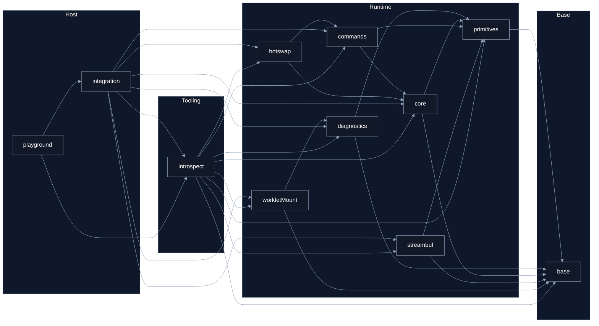

# Seqlok Packages

This directory holds the layered Seqlok workspace.  
Each package is a node in a strict one-way dependency graph.

## Packages

### Base

- `@seqlok/base`  
  Core types, numeric error codes, invariants and small helpers

### Runtime

- `@seqlok/primitives`  
  Seqlock, SWSR rings, atomics and low-level memory tools

- `@seqlok/diagnostics`  
  RT-safe telemetry primitives  
  Shared-memory snapshot schemas + SAB rings (writers in RT, readers on host)

- `@seqlok/core`  
  Shared state engine  
  Spec definition, layout planning, backing allocation, bindings and handoff

- `@seqlok/commands`  
  Command transport  
  Rings, mailboxes and control channels

- `@seqlok/streambuf`  
  Stream transport  
  Bulk SWSR buffers for PCM, bytes and frame streams (complements commands)

- `@seqlok/hotswap`  
  Engine lifecycle and swap protocol built on top of core and commands

- `@seqlok/worklet-mount`
  AudioWorklet/WASM mount runtime (kernel + protocol + host helpers)
  Canonical `wm:*` mount/ready/error/log boundary

### Tooling

- `@seqlok/introspect`  
  Observability and analysis tools  
  Health counters, lenses, tracing helpers, UI-friendly decoding

### Host / Apps

- `@seqlok/integration`  
  Host-side glue and higher-level adapters  
  Wiring examples for worklets, nodes, demos and host policies

- `@seqlok/playground`  
  Interactive UI labs  
  Visualizers, debug panels and example surfaces

## Diagnostics

Diagnostics is split into two parts:

- **`@seqlok/diagnostics` (Runtime):** RT-safe data structures and SharedArrayBuffer rings for telemetry.  
  Runtime code may _publish_ snapshots here with bounded work and zero allocations.
- **`@seqlok/introspect` (Tooling):** analysis, health lenses, counters, and UI-friendly decoding/aggregation.  
  Introspect may consume diagnostics rings, but runtime packages never import introspect.

This keeps `@seqlok/primitives` **schema-free**: primitives provide mechanisms (Atomics, rings, memory helpers),
while diagnostics owns the meaning (snapshot schemas and layouts).

## Dependency graph

Arrows show allowed imports between packages.  
`A --> B` means **package `A` may import `@seqlok/B`**.

## Rules

- Packages may only import **along the direction of an arrow**.
  If an arrow does not exist, that import is not allowed.

- Cross-package imports always use the public `@seqlok/*` entrypoints.

- If you add a new package, update both this diagram and the package-level docs in the same pull request.
