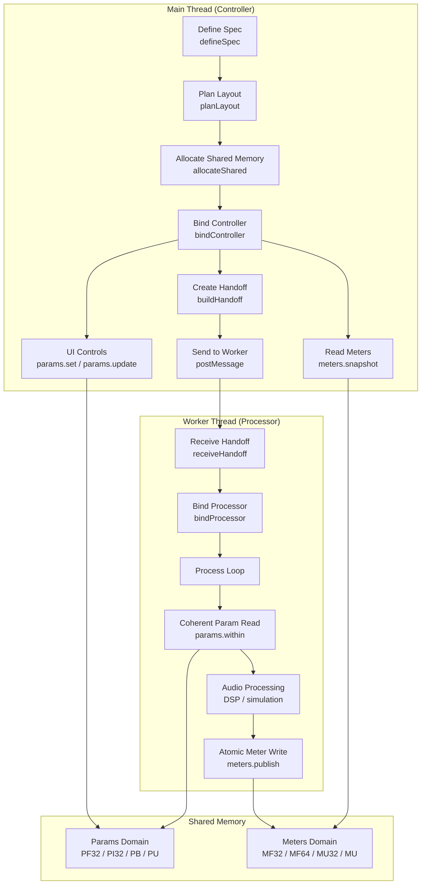
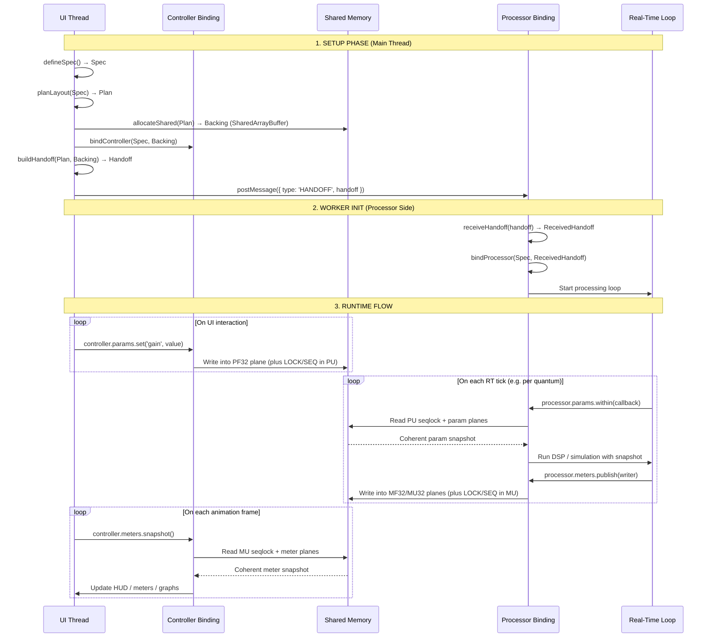
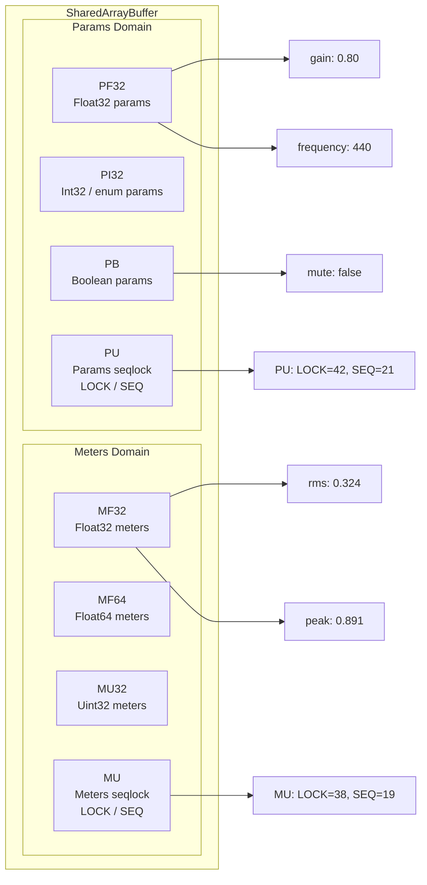
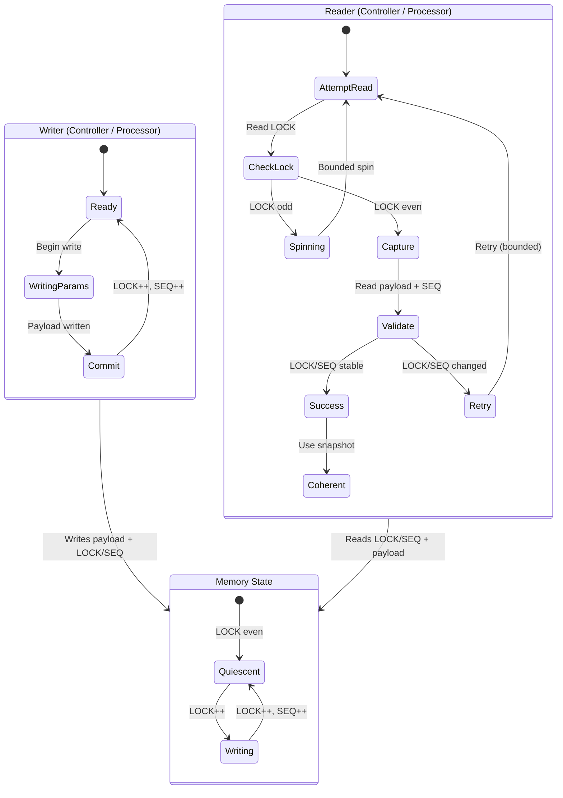
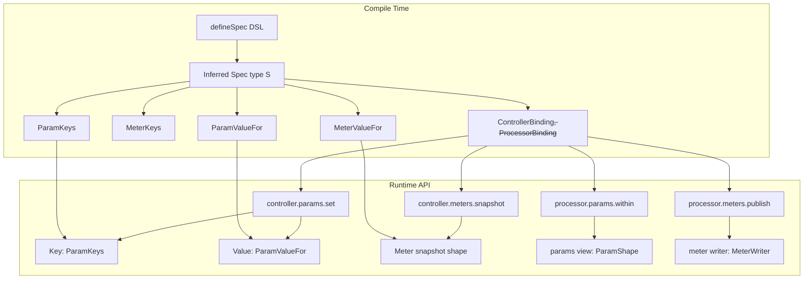

# Seqlok E2E Flow – Visual Guide

> How `spec → plan → backing → handoff → bindings` fit together across UI and real-time threads.

This document is the "single page mental model" for Seqlok's end-to-end flow:

- Main thread (controller) defines the shared state and owns **params**.
- Worker / AudioWorklet (processor) owns **meters** and the real-time loop.
- Both talk via a **plan-driven shared memory layout** (planes + seqlocks).

For deeper dives, see:

- `03-seqlok-concurrency-model-and-roles.md`
- `07-seqlok-api-shape-rationale.md`
- `08-seqlok-primitives-and-seqlock.md`
- `09-seqlok-backing-and-plane-plan.md`

---

## Architecture Overview

> **Verification note:** > `verifyHandoff(plan, received)` exists for diagnostics/tests and can be run on the **controller side** or in a non-RT worker. It is **not** part of the processor's hot path and is omitted from the canonical runtime pipeline above.

---

## Detailed Data Flow

> **Seqlock nuance:** Writers bump `LOCK` on enter/exit and bump `SEQ` on commit (the one-bump rule).
> The diagram compresses this to a single "update seqlock" step for readability.

---

## Memory Layout Visualization

- **Plan** computes exactly how each param/meter key maps into these planes.
- **Backing** allocates concrete memory and hosts the TypedArray views.
- **Bindings** use that plan to enforce safe, coherent access on each side.

---

## Seqlock Protocol Flow

Key properties:

- **Single writer per domain** (params vs meters).
- Readers are **lock-free** and **retry-based** with bounded spin/retry budgets.
- On success, readers see a **coherent snapshot**; they never observe partially written payload.

---

## Type Safety Flow

Story in plain terms:

- The DSL (`defineSpec`) defines a **single source of truth**: params + meters.

- The spec type `S` drives:

  - Valid param / meter keys.
  - The value types per key.
  - The shapes of controller/processor bindings.

- At runtime, you only get strongly-typed APIs:

  - `controller.params.set('gain', numberInRange)`
  - `controller.meters.snapshot()`
  - `processor.params.within(params => { … })`
  - `processor.meters.publish(writer => { … })`

Invalid keys/values are rejected at compile time; invalid layouts/backings are rejected at bind time.

---

## Complete E2E Timeline (Conceptual)

This is illustrative, not a performance chart. Units are arbitrary.

```mermaid
gantt
  title Seqlok E2E Timeline (Conceptual)
  dateFormat X
  axisFormat %s

  section Main Thread
    Define Spec & Plan: a1, 0, 10
    Allocate Memory: a2, after a1, 5
    Bind Controller: a3, after a2, 3
    Create Handoff: a4, after a3, 2
    Send to Worker: a5, after a4, 1
    UI Controls (ongoing): a6, after a5, 300
    Meter Reads (ongoing): a7, after a5, 300

  section Worker Thread
    Receive Handoff: b1, after a5, 2
    Bind Processor: b3, after b1, 3
    Process Loop (ongoing): b4, after b3, 300

  section Shared Memory
    Memory Ready: c1, after a2, 310
    Param Updates (ongoing): c2, after a6, 290
    Meter Updates (ongoing): c3, after b4, 290
```

---

## 🎯 Key Visual Takeaways

1. **Two independent domains**

- Params and meters sit in **separate planes** (`PF32/PI32/PB/PU` vs `MF32/MF64/MU32/MU`) with **separate seqlocks**.
- Controller writes params; processor writes meters. There's no cross-domain write contention.

2. **Seqlock-guarded coherence**

- All coherent param reads go through `processor.params.within`.
- All coherent meter reads go through `controller.meters.snapshot`.
- All meter commits go through `processor.meters.publish`.
- The seqlock protocol guarantees snapshot coherence with bounded retries.

3. **Type safety end-to-end**

- `defineSpec` → spec type `S` → bindings and key/value types.
- Invalid keys and values fail at compile time; mismatched backing/plan fails at bind time.

4. **Zero serialization / copies on the hot path**

- SharedArrayBuffer + TypedArrays + Atomics – no JSON, no structured clone, no memcpy loops.

5. **Real-time friendliness**

- Processor binding's hot path (`within` / `publish`) does **no allocations** and uses bounded, predictable seqlock operations.
- UI/main thread can be relatively "squishy"; the strict discipline is concentrated in the processor binding and backing.

This is the whole loop in one picture: **spec → plan → backing → handoff → bindings**, stitched together across agents by shared memory and seqlocks, with TypeScript keeping your keys and value types honest.
