# Coherent Reads & Memory Planes

> How readers obtain consistent snapshots without blocking writers, and how data is laid out across planes.

This document consolidates two topics that belong together in practice:
**(A)** the _seqlock-based coherent read protocol_ for params/meters, and
**(B)** the _memory plane layout_ backing those reads.

It complements:

- **08 – Primitives & Seqlock** (mechanics)
- **09 – Backing & Layout** (planner)
- **11 – E2E Visual Guide** (big-picture flow)

---

## 1. Seqlock state (recap)

Each SWMR family (params, meters) owns an independent control plane with two `Int32` slots:

```text
PU: [LOCK, SEQ]  // params control plane
MU: [LOCK, SEQ]  // meters control plane
```

- **LOCK** — parity-based lock used only by the single **writer** of that family.
- **SEQ** — monotonically increasing **commit stamp** (u32). Incremented exactly once per successful commit.

High-level writer behaviour (per family):

- While **writing**: `LOCK` is **odd**.
- When **quiescent**: `LOCK` is **even**.
- On each successful commit:

  - `SEQ` is bumped **once**.
  - `LOCK` returns to an even value.

Readers never mutate `LOCK`/`SEQ`; they only:

- Spin briefly while `LOCK` is odd (writer active).
- Use `SEQ` to detect whether a read window was stable (same value before/after payload sampling).

> For concrete budgets and failure modes (`spinBudget`, `retryBudget`, `primitives.seqlockTimeout`), see **08 –
> Primitives & Seqlock**.

---

## 2. Controller: reading meters coherently

The controller reads **meters** written by the processor. It must never see torn combinations of values.

### Conceptual algorithm (`meters.snapshot()`)

Internally, `controller.meters.snapshot()` uses the seqlock primitives (`acquire` / `tryRead`) over the **meter** pair
`(MU.LOCK, MU.SEQ)`:

```text
1. Spin until MU.LOCK is even (bounded).
2. Capture s1 = MU.SEQ.
3. Read all requested meter payload:
   - Copy scalars
   - Copy arrays (or reuse into-buffers, if provided)
4. Capture s2 = MU.SEQ.
5. Verify:
   - MU.LOCK is still even, and
   - s1 === s2
   → coherent snapshot
6. On mismatch:
   - Retry a bounded number of times.
   - If budgets exhausted:
     - Either return the last sampled value (degrade),
     - Or throw `primitives.seqlockTimeout` (depending on options).
```

The public `snapshot()` on the controller hides this complexity and just gives you:

- A **coherent** view by default, or
- A well-defined failure path (timeout) in degenerate cases.

### Flow diagram (conceptual)



```mermaid
%%{init: {"theme":"base","themeVariables":{"textColor":"#ffffff","primaryTextColor":"#ffffff","lineColor":"#94a3b8","primaryColor":"#111827","secondaryColor":"#0f172a","tertiaryColor":"#0b1220","clusterBkg":"#0f172a","clusterBorder":"#334155","primaryBorderColor":"#94a3b8"}} }%%
flowchart TD
  Start["meters.snapshot()"] --> R0["spin until MU.LOCK is even (bounded)"]
  R0 --> R1["capture s1 = MU.SEQ"]
  R1 --> Read["read meter payload<br/>(scalars + arrays)"]
  Read --> R2["capture s2 = MU.SEQ"]
  R2 --> Stable{"LOCK even<br/>and s1 == s2?"}
  Stable -- yes --> Ret["return snapshot"]
  Stable -- no --> Retry{"within budgets?"}
  Retry -- yes --> R0
  Retry -- no --> Degrade["degrade/throw<br/>(configurable)"]
  style Start fill: #1e293b
  style Ret fill: #065f46
  style Degrade fill: #7c2d12
```

### Usage (final API)

```ts
// controller side (simple full snapshot)
const { rms, spectrum } = controller.meters.snapshot(['rms', 'spectrum']);
// scalars → plain numbers, arrays → owned copies by default
```

With `version()` + `into` to avoid extra allocations:

```ts
const buffers = {
  spectrum: new Float32Array(2048),
};

let lastVersion = 0;

function frame() {
  const v = controller.meters.version(); // single atomic load
  if (v !== lastVersion) {
    const { rms, spectrum } = controller.meters.snapshot(['rms', 'spectrum'], {
      into: buffers, // reuse existing buffers
    });

    renderMeters(rms, spectrum);
    lastVersion = v;
  }
  requestAnimationFrame(frame);
}

frame();
```

- `version()` is a cheap wrapper around the meter SEQ (`MU.SEQ`).
- `snapshot([...], { into })` lets you reuse buffers for zero-allocation polling loops.

---

## 3. Processor: reading params coherently

The processor reads **params** written by the controller, via `processor.params.within(cb)`. Inside `cb`:

- **Scalars** are plain JS values captured coherently for the duration of the call.
- **Arrays** are ephemeral aliasing views into the backing planes (no allocation on the hot path).

### Conceptual algorithm (`params.within(cb)`)

Internally, the bindings use the seqlock over the **param** pair `(PU.LOCK, PU.SEQ)`:

```text
1. Spin until PU.LOCK is even (bounded).
2. Capture s1 = PU.SEQ.
3. Capture param scalars; map aliasing array views.
4. Capture s2 = PU.SEQ.
5. Verify:
   - PU.LOCK is still even, and
   - s1 === s2
   → coherent view
6. On mismatch:
   - Retry a bounded number of times.
   - If budgets exhausted: throw `primitives.seqlockTimeout`.
7. Invoke cb(view) within this coherent window.
```

The callback is **synchronous** and **scoped**:

- Do not `await` inside `within`.
- Do not store references to the `params` view or its inner arrays for later use.

### Flow diagram (conceptual)



```mermaid
%%{init: {"theme":"base","themeVariables":{"textColor":"#ffffff","primaryTextColor":"#ffffff","lineColor":"#94a3b8","primaryColor":"#111827","secondaryColor":"#0f172a","tertiaryColor":"#0b1220","clusterBkg":"#0f172a","clusterBorder":"#334155","primaryBorderColor":"#94a3b8"}} }%%
flowchart TD
  P0["params.within(cb)"] --> Pspin["spin until PU.LOCK is even (bounded)"]
  Pspin --> P1["capture s1 = PU.SEQ"]
  P1 --> Pcap["capture scalars<br/>map array views"]
  Pcap --> P2["capture s2 = PU.SEQ"]
  P2 --> Pstable{"LOCK even<br/>and s1 == s2?"}
  Pstable -- yes --> Pinvoke["invoke cb(params)"] --> Pdone["return"]
  Pstable -- no --> Pret{"within budgets?"}
  Pret -- yes --> Pspin
  Pret -- no --> Pthrow["throw seqlockTimeout"]
  style P0 fill: #1e293b
  style Pdone fill: #065f46
  style Pthrow fill: #7c2d12
```

### Usage

```ts
// processor side (AudioWorklet / worker)
processor.params.within((p) => {
  const ratio = p.timeRatio; // coherent scalar
  const coeffs = p.coeffs; // aliasing Float32Array view
  const out = this.dsp.process(input, ratio, coeffs);

  processor.meters.publish((m) => {
    m.peak(out.peak);
    m.rms(out.rms);
  });
});
```

Within a single `within` window, you are guaranteed:

- All params are mutually coherent (no mixed old/new state).
- Any number of `meters.publish(...)` calls derive causally from that snapshot.

---

## 4. Memory planes (what lives where)

Seqlok separates data by **type family** into planes. Each plane is a TypedArray over a shared backing; the planner
decides sizes and offsets.

### Param planes

```ts
// PF32: f32 scalars and arrays
// PI32: i32 scalars/arrays and enum indices
// PB  : bool scalars/arrays (0/1)
// PU  : control [LOCK, SEQ] for params
type PF32 = Float32Array;
type PI32 = Int32Array;
type PB = Uint8Array;
type PU = Int32Array;
```

| Plane | Stores                                                   | Notes                                   |
| :---: | :------------------------------------------------------- | :-------------------------------------- |
| PF32  | `param.f32`, `param.f32.array({ length })`               | IEEE754 single precision                |
| PI32  | `param.i32`, `param.i32.array({ length })`, enum indices | Enums stored as **indices**, not labels |
|  PB   | `param.bool`, `param.bool.array({ length })`             | 0 or 1 bytes                            |
|  PU   | `[LOCK, SEQ]`                                            | Seqlock state for params                |

**Not stored in planes:** field names, enum **labels**, or numeric ranges. Those live with the spec + bindings.

### Meter planes

```ts
// MF32: f32 meters/arrays
// MF64: f64 meters/arrays
// MU32: u32 meters and bool meters (0/1)
// MU  : control [LOCK, SEQ] for meters
type MF32 = Float32Array;
type MF64 = Float64Array;
type MU32 = Uint32Array;
type MU = Int32Array;
```

| Plane | Stores                                      | Notes                                   |
| :---: | :------------------------------------------ | :-------------------------------------- |
| MF32  | `meter.f32`, `meter.f32.array({ length })`  |                                         |
| MF64  | `meter.f64`, `meter.f64.array({ length })`  |                                         |
| MU32  | `meter.u32`, **bool meters** as 0/1 numbers | Pragmatic: Atomics require 32-bit views |
|  MU   | `[LOCK, SEQ]`                               | Seqlock state for meters                |

**Bool meter semantics:**
Exposed as **0/1 numbers** in controller snapshots to avoid per-frame conversions and keep planes minimal.

### Indexing rule

The planner emits `offset` in **bytes** and `length` in **elements**.

To access a given plane:

```ts
const view = new Float32Array(sharedBuffer);
const index = offsetBytes / Float32Array.BYTES_PER_ELEMENT;
const value = view[index];
```

Bindings precompute these indices; user code never deals with raw `offsetBytes` directly.

---

## 5. Guarantees, budgets, and costs

Within the documented roles and helpers:

- **Coherent by construction**

  - `params.within` and `meters.snapshot` always pair their reads with seqlock state.
  - Readers never see torn combinations for a given family (params vs meters).

- **Zero allocations on hot paths**

  - Processor-side `params.within` + `meters.publish` allocate nothing.
  - Controller-side `meters.snapshot([...], { into })` can be fully allocation-free if `into` buffers are reused.

- **Bounded retries**

  - Readers spin & retry only while a writer is mid-commit.
  - Budgets (`spinBudget`, `retryBudget`, `maxAttempts`) prevent unbounded loops.
  - Timeouts surface as `primitives.seqlockTimeout` with telemetry-friendly details.

- **Cheap change detection**

  - `params` and `meters` expose `version()` as a single atomic `SEQ` load.
  - Poll `version()` to avoid unnecessary snapshot work when nothing has changed.

---

## 6. Where to go next

- **08 – Primitives & Seqlock** — dual-counter seqlock design, `tryRead`, `acquire`, `publish`, error paths.
- **09 – Backing & Layout** — planes, alignment, packing, backing flavors (SAB / per-plane / shared Wasm).
- **11 – E2E Visual Guide** — how `spec → plan → backing → handoff → bindings` fit together across controller and
  processor.

Taken together, these give you the full picture: **how bytes are laid out, how seqlocks guard them, and how high-level
helpers turn that into coherent snapshots.**
