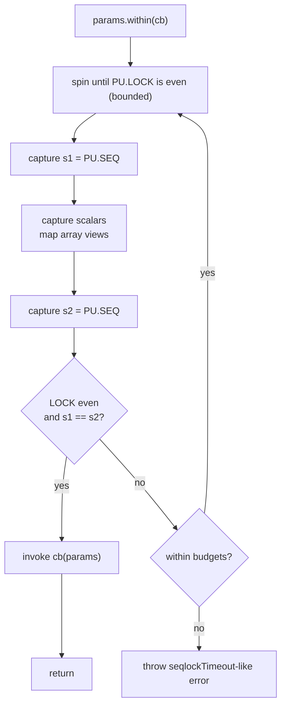

# Coherent Reads & Memory Planes

> How readers obtain consistent snapshots without blocking writers, and how data is laid out across planes.

This document brings together two closely related topics:

- **Coherent reads** – how seqlock is used (or intentionally not used) by different roles.
- **Memory planes** – how params and meters are laid out in shared memory.

It complements:

- **03 – Concurrency model and roles** (Controller / Processor / Observer)
- **10 – Primitives & seqlock**
- **11 – Backing & plane layout**
- **16 – E2E flow visual guide**
- **17 – Hot vs cold path design philosophy**

---

## 1. Seqlock state (recap)

Each SWMR family (params, meters) owns an independent control plane with two `u32` slots:

```text
PU: [LOCK, SEQ]  // params control plane (Uint32Array)
MU: [LOCK, SEQ]  // meters control plane (Uint32Array)
```

- **LOCK** – parity-based lock used only by the single **writer** of that family.
- **SEQ** – monotonically increasing **commit stamp** (`u32`). Incremented exactly once per successful commit.

High-level writer behaviour (per family):

- While **writing**: `LOCK` is **odd**.
- When **quiescent**: `LOCK` is **even**.
- On each successful commit:

  - `SEQ` is bumped **once**.
  - `LOCK` returns to an even value.

Readers never mutate `LOCK`/`SEQ`; they only:

- Spin briefly while `LOCK` is odd (writer active).
- Use `SEQ` to detect whether a read window was stable (same value before/after payload sampling).

Concrete budgets (`spinBudget`, `retryBudget`, timeout behaviour) are defined in the seqlock primitives and ADRs; this
doc stays at the architectural level.

---

## 2. Roles and coherence guarantees

Seqlok's bindings are built around three roles:

- **Processor** – hot path, real-time work.
- **Controller** – cold path, orchestration and UI logic.
- **Observer** – hot read-side for high-frequency visualizers, shipped as a first-class binding via `bindObserver`.

They do _not_ all promise the same level of coherence.

### 2.1 Processor binding – hot path, hard coherence

**Who:** AudioWorklet / worker / real-time processor.

**Responsibilities:**

- Read params under seqlock via `params.within(...)`.
- Publish meters under seqlock via `meters.publish(...)`.

**Guarantees:**

- **Params:** hard coherence.

  - Reads use seqlock internally.
  - No half-written arrays.
  - No mixed frames within a single `within(...)` callback.

- **Meters:** writer side is seqlock-protected.

  - Any reader that uses a seqlock-aware snapshot will see meter frames that correspond to a specific param snapshot.

This is the **reference implementation** of "coherent snapshot under seqlock". If we ever did a "naked read" for params
here, that would be a bug.

---

### 2.2 Controller binding – cold path, best-effort meters

**Who:** Main-thread controller, orchestration, UI, presets.

**Responsibilities:**

- Authoritative writer for **params**.
- Optionally read back params / meters to drive UI and tools.

**Concurrency reality:**

- **Params:** controller is the **only writer**. The processor never writes params.

  - Controller param reads are not racing with another writer.
  - Naked reads are safe by design for params.

- **Meters:** controller is a **reader** observing processor-written state.

  - Meters may be updated concurrently while the controller is reading.

**Contract:**

- Controller meter snapshots are explicitly **cold-path, best-effort**:

  - Good for UI, tooling, and "rough" diagnostics.
  - Allowed to observe mixed meter frames under heavy contention.
  - **Not** suitable for strict, frame-perfect visualizations.

The controller binding deliberately avoids pulling in diagnostics and rich policy. It stays small and cheap; stronger
guarantees live in the observer role.

---

### 2.3 Observer role – hot read path, coherent visualizer

**Who:** High-frequency visualizers (e.g. waveforms, swarms, analyzers) that need consistent frames.

**Status:** **shipped** in `@seqlok/core` (`bindObserver`).

Observer bindings are real public bindings with the same trust-boundary story
as `bindProcessor`. Higher layers (`@seqlok/compose`, host apps, drivers)
only compose topologies and routes; they do not own the seqlock protocol.

**Responsibilities:**

- High-rate, read-only access to meters (and optionally selected param views).
- Provide **coherent per-frame snapshots** suitable for rendering, with policy for degraded conditions.

**Coherence strategy:**

- Observer reads meters under `MU` seqlock using a policy-aware helper (conceptually `snapshotWithPolicy`):

  - Wraps a low-level snapshot function with seqlock and a retry/degrade policy.
  - If the writer is mid-commit:

    - Spin and retry within a bounded budget, or
    - Fall back to a degrade policy (e.g. reuse last good frame, mark frame as stale).

- Observer is allowed to depend on diagnostics:

  - It may increment counters.
  - It may classify "too many retries", "degraded snapshot", etc.

**Contract:**

- Observer is where the **strong, visualizer-grade coherence guarantee** for meters lives.
- If you need strict, non-torn frames at 60–240 Hz, you should be reading via an observer-style path, not via the plain
  controller snapshot.

---

## 3. Processor: reading params coherently

The processor reads **params** written by the controller via `processor.params.within(cb)`. Inside `cb`:

- **Scalars** are plain JS values captured coherently for the duration of the call.
- **Arrays** are ephemeral aliasing views into the backing planes (no allocation on the hot path).

### Conceptual algorithm – `params.within(cb)`

The binding uses seqlock over `(PU.LOCK, PU.SEQ)`:

```text
1. Spin until PU.LOCK is even (bounded).
2. Capture s1 = PU.SEQ.
3. Capture param scalars; map aliasing array views.
4. Capture s2 = PU.SEQ.
5. Verify:
   - PU.LOCK is still even, and
   - s1 === s2
   → coherent view
6. On mismatch:
   - Retry a bounded number of times.
   - If budgets exhausted: throw a seqlock timeout error.
7. Invoke cb(view) within this coherent window.
```

The callback is **synchronous** and **scoped**:

- Do **not** `await` inside `within`.
- Do **not** store references to the param view or inner arrays for later use.

### Flow diagram (conceptual)



### Usage

```ts
// processor side (AudioWorklet / worker)
processor.params.within((p) => {
  const ratio = p.timeRatio; // coherent scalar
  const coeffs = p.coeffs; // aliasing Float32Array view

  const out = this.dsp.process(input, ratio, coeffs);

  processor.meters.publish((m) => {
    m.peak(out.peak);
    m.rms(out.rms);
  });
});
```

Within a single `within` window:

- All params are mutually coherent.
- Any number of `meters.publish(...)` calls derive causally from that snapshot.

---

## 4. Observer: reading meters coherently

The observer role is the **read-side twin** of the processor's coherent writes.

### Conceptual algorithm – observer snapshot

Conceptually, an observer snapshot looks a lot like `params.within`, but on `MU`:

```text
1. Spin until MU.LOCK is even (bounded).
2. Capture s1 = MU.SEQ.
3. Read meter scalars; copy or alias meter arrays.
4. Capture s2 = MU.SEQ.
5. Verify:
   - MU.LOCK is still even, and
   - s1 === s2
   → coherent frame
6. On mismatch:
   - Retry up to retryBudget.
   - If still failing, apply policy:
     - reuse last good frame, and/or
     - increment diagnostics and mark this frame as degraded.
```

A policy-aware helper (conceptually `snapshotWithPolicy`) wraps this in a single call so the observer code stays simple
and the policy is testable in isolation.

### Usage sketch

The observer binding is available via `bindObserver` in `@seqlok/core`. Example usage:

```ts
const received = receiveHandoff(handoff);
const observer = bindObserver(received, {
  /* observer options */
});

const frameBuffers = {
  spectrum: new Float32Array(2048),
};

function renderLoop() {
  const frame = observer.meters.snapshotWithPolicy(["rms", "spectrum"], {
    into: frameBuffers,
    // policy options: budgets, degrade behaviour, etc.
  });

  if (!frame.degraded) {
    renderVisualizer(frame.rms, frame.spectrum);
  }

  requestAnimationFrame(renderLoop);
}
```

Key properties we will preserve for any eventual observer binding:

- Visualizer gets **coherent** frames (no ghost combinations).
- Policy decides how to behave under high contention.
- Diagnostics can track how often we had to degrade.

---

## 5. Controller: best-effort meter snapshots

Controller meter snapshots intentionally live at a lower guarantee level.

### Conceptual algorithm – controller meters snapshot

For the controller, a typical `snapshot` is just:

```text
1. Read requested meter scalars.
2. Copy requested meter arrays into fresh or provided buffers.
3. Return the sampled values.
```

There is **no** seqlock dance for meters on the controller:

- Reads may overlap with processor writes.
- It is possible to observe a frame where some fields are from "before" and some from "after" an update.

That sounds scary in the abstract, but for:

- UI meters,
- debugging panels,
- coarse-grained tooling,

this is an acceptable trade-off: simpler implementation, no diagnostics coupling, and still extremely useful.

### Usage

```ts
// controller side (UI / tools)
const { rms, spectrum } = controller.meters.snapshot();
// Suitable for meters and debug HUDs; not for strict visualizers
```

If you need strict coherence, you should read via an observer-style path instead.

---

## 6. Memory planes: what lives where

Seqlok separates data by **type family** into planes. Each plane is a TypedArray over a shared backing; the planner
decides sizes and offsets based on the spec.

### 6.1 Param planes

```ts
// PF32: f32 scalars and arrays
// PI32: i32 scalars/arrays and enum indices
// PB  : bool scalars/arrays (0/1)
// PU  : control [LOCK, SEQ] for params
type PF32 = Float32Array;
type PI32 = Int32Array;
type PB = Uint8Array;
type PU = Uint32Array;
```

| Plane | Stores                                                   | Notes                                    |
| :---: | :------------------------------------------------------- | :--------------------------------------- |
| PF32  | `param.f32`, `param.f32.array({ length })`               | IEEE754 single precision                 |
| PI32  | `param.i32`, `param.i32.array({ length })`, enum indices | Enums stored as **indices**, not labels  |
|  PB   | `param.bool`, `param.bool.array({ length })`             | 0 or 1 bytes                             |
|  PU   | `[LOCK, SEQ]`                                            | Seqlock state for params (`Uint32Array`) |

**Not** stored in planes: field names, enum labels, or numeric ranges. Those live with the spec and bindings.

---

### 6.2 Meter planes

```ts
// MF32: f32 meters/arrays
// MF64: f64 meters/arrays
// MU32: u32 meters and bool meters (0/1)
// MU  : control [LOCK, SEQ] for meters
type MF32 = Float32Array;
type MF64 = Float64Array;
type MU32 = Uint32Array;
type MU = Uint32Array;
```

| Plane | Stores                                     | Notes                                    |
| :---: | :----------------------------------------- | :--------------------------------------- |
| MF32  | `meter.f32`, `meter.f32.array({ length })` |                                          |
| MF64  | `meter.f64`, `meter.f64.array({ length })` |                                          |
| MU32  | `meter.u32`, bool meters as 0/1 numbers    | Pragmatic: Atomics want 32-bit views     |
|  MU   | `[LOCK, SEQ]`                              | Seqlock state for meters (`Uint32Array`) |

Bool meters are exposed to JS as **0/1 numbers** to avoid per-frame conversions and keep planes minimal.

---

### 6.3 Indexing rule

The planner emits:

- `offsetBytes` – byte offset from the start of the backing.
- `length` – element length in that plane.

Bindings use this to construct views:

```ts
const view = new Float32Array(sharedBuffer);
const index = offsetBytes / Float32Array.BYTES_PER_ELEMENT;
const value = view[index];
```

User-facing bindings precompute these indices so user code never touches raw offsets.

---

## 7. Guarantees, budgets, and costs (summary)

Within the documented roles and helpers:

- **Coherent by construction**

  - `processor.params.within` and observer-style meter snapshots pair reads with seqlock state.
  - Readers using these helpers never see torn combinations for that family.

- **Zero allocations on hot paths**

  - Processor-side `params.within` + `meters.publish` allocate nothing.
  - Observer snapshots can reuse buffers (`into`) to avoid allocations.
  - Controller snapshots can _also_ reuse buffers, but are still "best-effort" in terms of coherence.

- **Bounded retries**

  - Seqlock-based readers spin & retry only while a writer is mid-commit.
  - Budgets prevent unbounded loops and surface timeouts as clear errors or degraded frames.

- **Cheap change detection**

  - `version()` on params/meters exposes the underlying `SEQ` as a single atomic load.
  - Poll `version()` to avoid unnecessary snapshot work when nothing has changed.

---

## 8. Where to go next

If you need more detail or want to see how this plugs into the rest of the system:

- **Primitives & Seqlock** – dual-counter design, `tryRead`, `publish`, error paths.
- **Backing & layout** – plane planning, alignment, and backing flavours (single SAB / split / shared Wasm).
- **Concurrency model & roles** – how Controller, Processor, and Observer interact beyond just coherence.
- **Hot vs cold path design philosophy** – why not “just use seqlock everywhere”.
- **ADR docs for observer & MWMR** – the deeper rationale behind the role split and topology-level MWMR.

Together, these give the full picture: **how bytes are laid out, how seqlocks guard them, and how each role is allowed
to read or write those bytes.**
