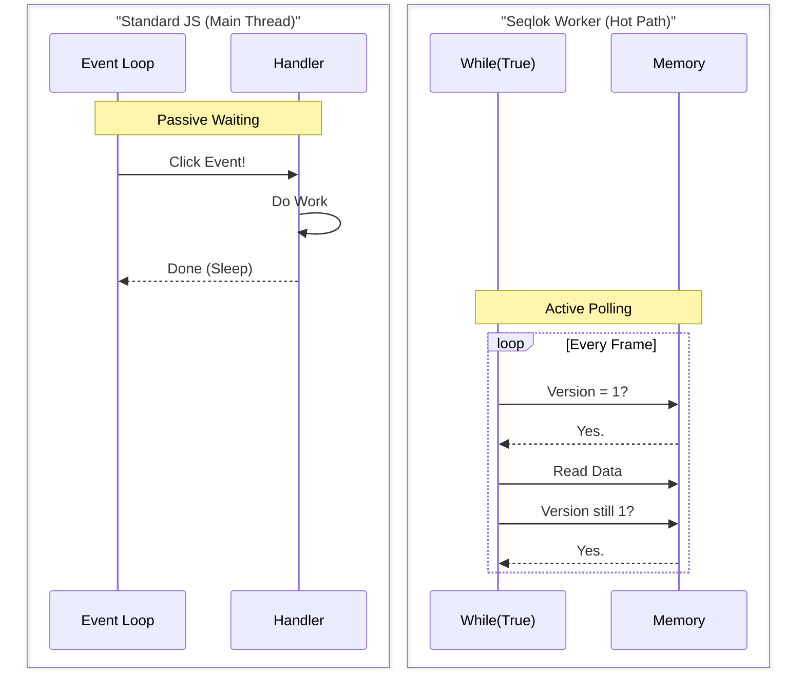

# 🧠 Onboarding: The Seqlok Mindset

**"You are not in the Event Loop anymore."**

If you are coming from standard React, Node, or Vue development, Seqlok requires you to unlearn a few habits. In
standard JavaScript, you wait for an event (click, fetch) and then react. In Seqlok's hot path, we do not wait. We *
*poll**.

## The Mental Shift: Standard JS vs. Seqlok

| Feature       | Standard JavaScript (The "easy" way)                   | Seqlok Hot Path (The "fast" way)                                        |
|:--------------|:-------------------------------------------------------|:------------------------------------------------------------------------|
| **Execution** | **Event-Driven:** "Wake me up when the user clicks."   | **Loop-Driven:** "Check the user status. Check again. Check again."     |
| **Memory**    | **Garbage Collected:** `const x = { val: 1 }` is fine. | **Static Allocation:** Creating objects is forbidden. Reuse everything. |
| **Data Flow** | **Pass-by-Reference:** Passing objects is cheap.       | **Shared Memory:** Objects don't exist. We read raw bytes.              |
| **Safety**    | **Single Threaded:** No race conditions.               | **Multi-Threaded:** If you don't lock, data corrupts.                   |
| **Debugging** | `console.log(obj)` works everywhere.                   | `console.log` **crashes performance** and hides bugs.                   |

## ⚠️ The "Zero-GC" Rule

In the **Processor** (Physics/Audio worker) and the **Observer** (Visualizer), you are **forbidden from allocating
memory** inside the loop.

This rule applies to **hot path loops** (processor ticks, observer frames). It is still fine to allocate during setup,
configuration, and other **cold-path** code (controller UI, bootstrapping, error handling, etc.).

- ❌ **Bad:** `return { x: 10, y: 20 }`
  Creates a new object every frame. Causes GC stutter.
- ✅ **Good:** `target.x = 10; target.y = 20;`
  Writes to existing memory. Zero cost.

---

## Thinking in Bytes: The Spec DSL (No Classes Allowed)

JavaScript developers are used to JSON (`{ "x": 10, "y": 20 }`). They rarely think about **memory layouts** (structs).
In Seqlok, you don't pass objects; you pass **offsets** into shared memory.

If a developer doesn't understand that `Float32` takes 4 bytes, they will align their memory incorrectly and read
garbage data. The Spec DSL exists so you only have to describe the layout once; Seqlok then gives you strongly-typed,
zero-allocation views over that layout.

In standard TypeScript, you might write a class to manage data. **In Seqlok, you define a Spec.**

We do not create "view classes" or wrapper objects. Instead, you define the memory structure once using the DSL. Seqlok
generates the optimized views for you automatically inside the `within` and `snapshot` callbacks.

### The Pattern: `defineSpec`

Instead of writing a class with getters and setters, you describe the layout data types:

```ts
import { defineSpec } from "@seqlok/core";

// 1. Define the structure (the "schema")
export const boidSpec = defineSpec(({param, meter}) => ({
  params: {
    // Scalars are just numbers
    separation: param.f32({min: 0, max: 10}),
    alignment: param.f32({min: 0, max: 10}),
    // Arrays are fixed-length blocks
    target: param.f32.array({length: 3}), // [x, y, z]
  },
  meters: {
    // The processor writes these back to us
    fps: meter.f32(),
    count: meter.u32(),
  },
}));
```

### Reading and Writing (Functional Access)

You don't instantiate a `Boid` object. You use the binding functions to access the raw memory safely.

**Controller (Main Thread):**

```ts
// Write directly using the key from the spec
controller.params.set("separation", 5.5);

// Zero-allocation array write
controller.params.stage("target", (view) => {
  view[0] = 10; // x
  view[1] = 20; // y
  view[2] = 0; // z
});
```

**Processor (Worker Thread):**

```ts
// 'p' is a temporary, stack-allocated view valid ONLY inside this function
processor.params.within((p) => {
  const sep = p.separation; // Direct read from SharedArrayBuffer

  // No "new Vector3()", just raw access
  const tx = p.target[0];
  const ty = p.target[1];
  const tz = p.target[2];

  // ... compute flocking forces using sep + (tx, ty, tz) ...
});
```

---

## Visualizing the Hot Path Loop

The standard Event Loop (A) is "push"-based. The Seqlok loop (B) is "pull"-based.



---

## 🛠️ Deployment & Troubleshooting

Because Seqlok uses `SharedArrayBuffer`, browsers treat it as a "dangerous" feature (due to Spectre/Meltdown security
risks). It will **fail silently** if your server is not configured correctly.

### 1. The "Security Wall" (Required Headers)

You cannot use Seqlok on a deployed website (Vercel, Netlify, AWS) without these two HTTP headers. If these are missing,
`SharedArrayBuffer` will be undefined.

```http
Cross-Origin-Opener-Policy: same-origin
Cross-Origin-Embedder-Policy: require-corp
```

#### Why?

This isolates your browser process so it cannot share memory with cross-origin popups or iframes.

- **Constraint:** You cannot load images from external CDNs (e.g., `imgur.com`) unless those CDNs also send Cross-Origin
  headers (CORP).
- **Requirement:** Your site **must be served over HTTPS** (except for `localhost`).

### 2. The "Heisenbug" (Do Not Console Log)

A "Heisenbug" is a bug that disappears or changes behavior when you try to study it.

**The Trap:**
If you add `console.log()` inside a Seqlok reader loop to debug a race condition, the bug will vanish.

- **Reason:** `console.log` is extremely slow (milliseconds). The Seqlock retry loop is extremely fast (nanoseconds).
- **Result:** By logging, you artificially slow down the reader, making it "miss" the collision window with the writer.
  You will think the code is fixed, delete the log, and it will break again.

**The Fix:**
Use a **Flight Recorder** pattern. Write error codes or key state to a pre-allocated array in memory, and only inspect
that array if the application crashes or pauses.

---

## Bootstrapping & Environment Safety

Seqlok provides built-in utilities to verify the environment before you even attempt to allocate memory. Using these is
safer than writing your own checks because they handle edge cases (like Node vs Browser vs Electron).

### A. Asserting Environment Support

Don't wait for a crash. Fail fast during initialization using `assertSabSupport`.

```ts
import { assertSabSupport } from "@seqlok/core";

function initDevice() {
  try {
    // This throws a specific 'env.unsupported' or 'env.coopCoepRequired'
    // error if headers are missing.
    assertSabSupport("MyDeviceInit");

    // ... proceed to planLayout and allocateShared ...
  } catch (error) {
    // See "Troubleshooting with interpretHealth" below
    reportError(error);
  }
}
```

### B. Probing (Non-Throwing)

If you want to feature-detect without crashing, use `probeEnv`.

```ts
import { probeEnv } from "@seqlok/core";

const env = probeEnv();

if (env.kind === "browser" && !env.crossOriginIsolated) {
  console.warn(
    "Running in degraded mode: Seqlok disabled due to missing COOP/COEP.",
  );
  // Fallback logic here
}
```

---

## Troubleshooting with `interpretHealth`

Seqlok errors are structured. Instead of parsing error strings, use the `interpretHealth` utility to decide how to react
to a crash.

This is particularly useful for UI feedback ("Do I tell the user to reload, or just retry?").

```ts
import {
  SeqlokError,
  isSeqlokError,
  interpretHealth,
} from "@seqlok/base";
import { getErrorMeta } from "@seqlok/introspect";

try {
  // ... seqlok operations ...
} catch (err) {
  if (isSeqlokError(err)) {
    // 1. Get metadata about this specific error code
    const meta = getErrorMeta(err.code);

    // 2. Interpret what this means for system health
    const health = interpretHealth(meta);

    console.error(`${health.label}: ${err.message}`);

    if (health.hint) {
      console.info(`Suggestion: ${health.hint}`);
    }

    // 3. Decide on recovery
    if (!health.recoverable) {
      // Fatal: the shared memory might be corrupted or the config is impossible.
      // Stop the engine completely.
      engine.stop();
    } else {
      // Optionally implement non-fatal recovery: retry, rebuild, or soft-disable.
    }
  } else {
    throw err; // Unknown error
  }
}
```

---

## Further Reading

- **Architecture – Concurrency Model and Roles** – deeper dive into Controller vs Processor vs Observer domains.
- **Architecture – Error System and Fail-Fast Philosophy** – details on `isSeqlokError`, `interpretHealth`, and recovery
  strategies.
- **From Pipe to Hub: Understanding Seqlok's Architecture** – how Seqlok composes SWSR domains, rings, hubs, and
  observers into system-level MWMR.
