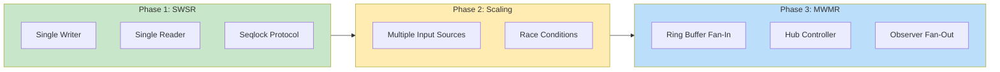
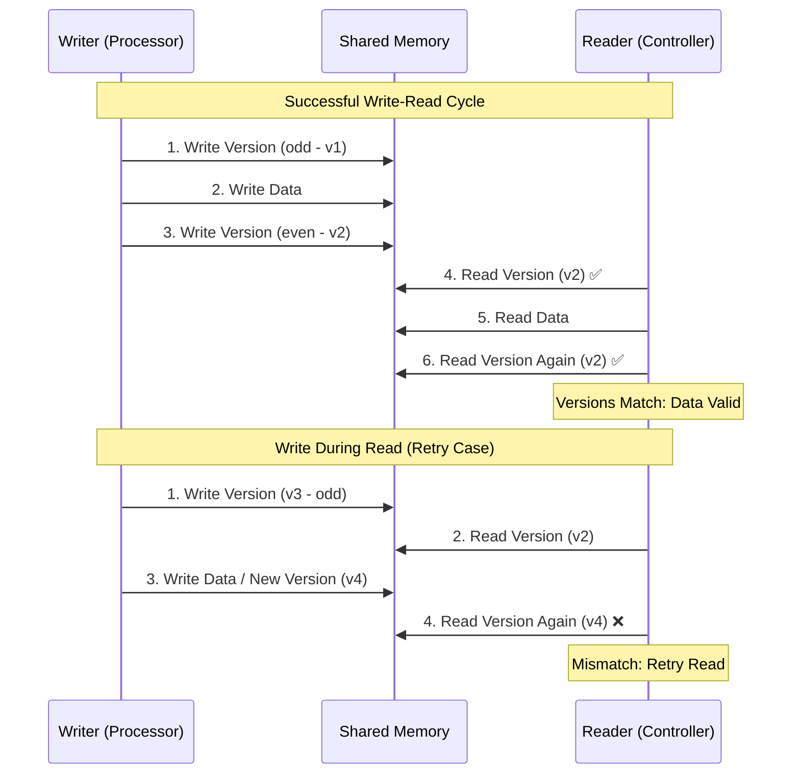
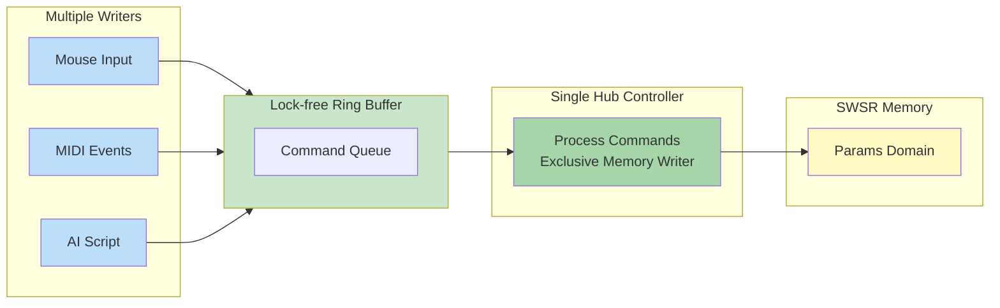
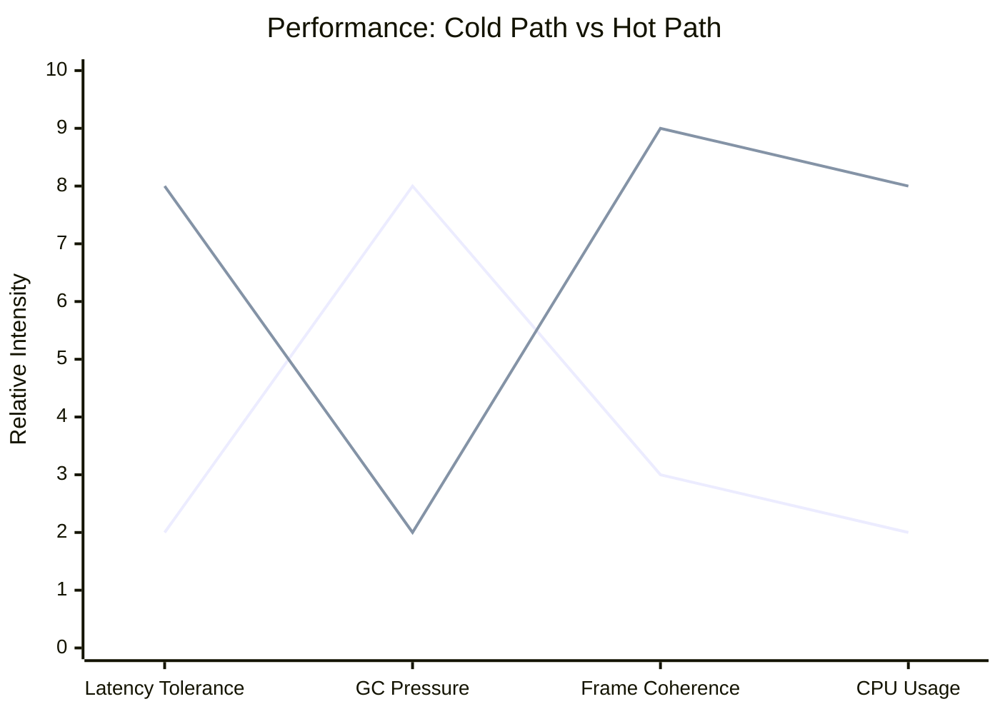
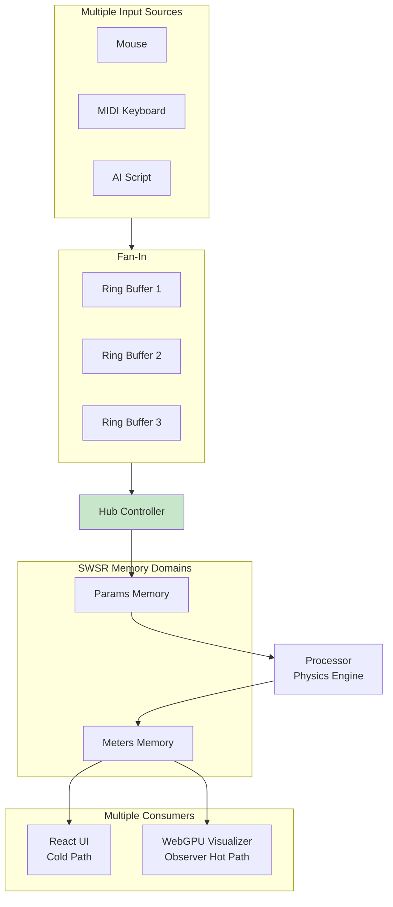
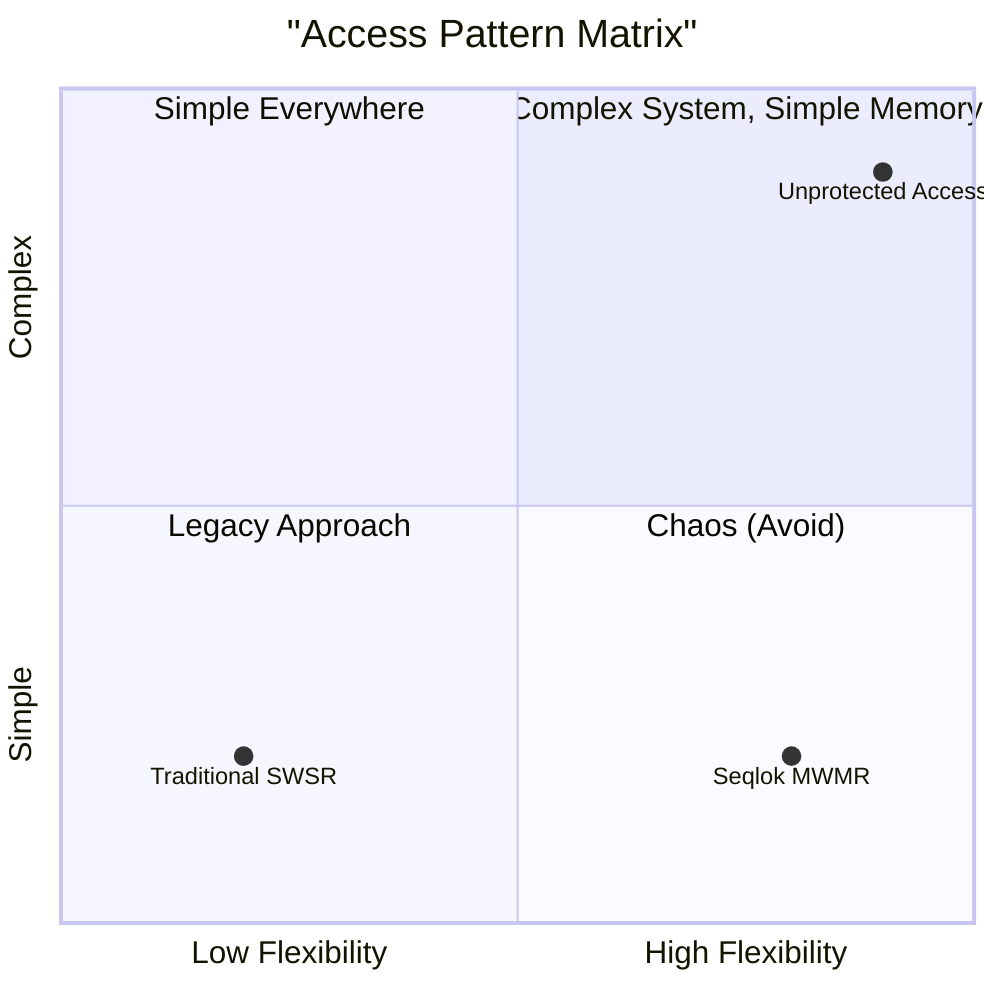

# From Pipe to Hub: Understanding Seqlok's Architecture

Welcome. You are looking at **Seqlok**, a high-performance library for sharing state between threads (like the Main Thread and a Physics Worker) without blocking the UI or creating garbage collection pauses.

To understand where we are today (**MWMR**), we must first understand the evolution of the system.

## The Evolution Timeline

---

## Phase 1: The Foundation (SWSR)

**"One writer holds the pen. Everyone else waits."**

At its core, Seqlok manages a block of **Shared Memory** (`SharedArrayBuffer`). Because two threads accessing the same memory at the same time causes chaos (race conditions), we established a strict **Single-Writer / Single-Reader (SWSR)** rule per domain.

### The Two Domains

We split the world into two lanes to avoid traffic jams:

1. **Params (Inputs):** The User changes a slider. Data flows **Controller → Processor**.
2. **Meters (Outputs):** The Engine reports a position. Data flows **Processor → Controller**.

### The Mechanism: The Seqlock

How do we read without locking the thread? We use a **Sequence Lock (Seqlock)**. This protocol ensures the audio/physics engine **never waits**. It just writes. The reader (UI) might have to retry, but the critical path never stops.

---

## Phase 2: The Scaling Problem

**"What if we have more than one input?"**

The SWSR model works perfectly for `UI ↔ Audio`. But complex apps (like the Flocking Simulation or Dekzer) look like this:

- **Writers:** Mouse, MIDI Keyboard, Network Multiplayer, AI Script.
- **Readers:** React UI (DOM), WebGPU Visualizer (Canvas), Telemetry Logger.

If we let the MIDI worker and the Mouse write to the **Params** memory at the same time, they overwrite each other (**Corruption**). If the WebGPU thread reads while the Physics thread writes, it sees a "torn frame" (**Visual Glitches**).

We needed **Multi-Writer, Multi-Reader (MWMR)**.

---

## Phase 3: The Solution (System-Level MWMR)

**"The memory stays strict. The system becomes flexible."**

We realized we didn't need to change the low-level memory (which is fast because it is simple). We needed to change the **topology**.

### 1. Fan-In (Many Writers → One Hub)

To handle multiple inputs (MIDI, UI, AI), we don't let them touch the shared memory directly. Instead, they put **Commands** into a queue.

- **The Ring Primitive:** A lock-free circular buffer. It acts like a mailbox.
- **The Hub:** One specific thread (usually the Controller) acts as the "Hub." It opens the mailboxes, decides what to do, and is the **only one allowed to write** to the Params memory.

In Seqlok, fan-in is built from **SWSR rings**: each ring is still single-writer / single-reader, but the system uses many rings (one per writer or per channel) feeding into a single hub. The hub pulls from those rings and remains the **only writer** to the shared Params domain, so the memory itself never leaves SWSR.

**Result:** The memory still sees only one writer (The Hub), but the _system_ accepts inputs from everywhere.

### 2. Fan-Out (One State → Many Observers)

To handle multiple visualizations (UI, WebGPU), we introduced the **Observer**.

- **The Problem:** The Controller reads are "Best Effort" (lazy). Great for UI, bad for high-speed graphics which need 60 fps coherence.
- **The Observer:** A specialized **Hot Path** reader. It uses the Seqlock protocol strictly. It spins/retries until it gets a perfect frame.
- **Safety:** An Observer is **Read-Only**. You can spawn many of them. They never interfere with the physics engine.

In concrete terms, the Observer is wired using the `bindObserver` API: it binds into the same shared memory as the Controller and Processor, but exposes a read-only, hot-path-optimized view dedicated to visualizers and other consumers that need stricter coherence.

The difference between the **Cold Path** (UI) and **Hot Path** (Observer) is visualized below:

> **Legend:** **Blue Line** = Cold Path (Controller), **Orange Line** = Hot Path (Observer)

### The Complete Architecture

When we combine Fan-In and Fan-Out, the full Seqlok architecture looks like this:

---

## Summary: The Learning Curve

The key takeaway is that complexity is handled at the topology level, allowing the memory level to remain simple and fast.

| Concept        | Phase    | Explanation                                   | Use Case                               |
| :------------- | :------- | :-------------------------------------------- | :------------------------------------- |
| **Controller** | **SWSR** | The Boss. Writes rules (Params). Reads stats. | **Cold Path** (UI updates)             |
| **Processor**  | **SWSR** | The Engine. Calculates physics. Writes stats. | **Hot Path** (Real-time Audio/Physics) |
| **Ring**       | **MWMR** | The Mailbox. Lock-free fan-in.                | Command aggregation (MIDI/Net)         |
| **Observer**   | **MWMR** | The Camera. Takes perfect snapshots.          | **Hot Path** (GPU Rendering)           |

### The Golden Rule: System Topology vs Memory Access

**"MWMR exists only at the system topology level, never at the primitive/memory level."**

### See Also

- **ADR-00Y – MWMR Architecture** – the normative design for rings, hub, and observer roles.
- **Onboarding: The Seqlok Mindset and Hot Path** – how the MWMR topology feels from a developer’s point of view.
